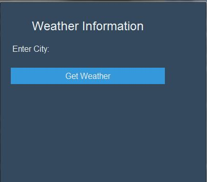

# Weather Information Application

The Weather Information Application is a simple Python GUI application built using the Tkinter library. It allows users to enter a city name and retrieve real-time weather information for that city using the WeatherAPI service.



## Features

- Input field to enter the city name.
- "Get Weather" button to fetch the weather information for the specified city.
- Real-time weather information displayed in a pop-up message box.
- Support for triggering the weather retrieval using the Enter key.

## Requirements

- Python 3.x
- Tkinter library (usually included with Python installations)

## How to Use

1. Make sure you have Python 3.x installed on your computer.
2. Clone or download this repository to your local machine.
3. Open a terminal or command prompt and navigate to the directory where the repository is located.
4. Run the following command to launch the Weather Information Application:
```bash
python main.py
```

5. The application window will open, allowing you to enter a city name in the input field.
6. Press the "Get Weather" button or simply press the Enter key to retrieve the weather information for the specified city.
7. The weather information, including current temperature, feels-like temperature, wind speed, humidity, pressure, precipitation, and cloud cover, will be displayed in a pop-up message box.

## API Key

To successfully fetch weather data, you need to obtain an API key from [WeatherAPI](https://weatherapi.com). The API key should be added to the `api_key` variable in the `get_weather` function. Please make sure to replace `'YOUR_API_KEY'` with your actual WeatherAPI key.
```python
def get_weather(city):
    api_key = 'YOUR_API_KEY' # Replace 'YOUR_API_KEY' with the actual API key from WeatherAPI
# ....
```

## Acknowledgments

- The application uses the [WeatherAPI](https://www.weatherapi.com/) service to retrieve weather data.

## License

This project is licensed under the [MIT License](LICENSE.txt).

---

Feel free to customize the README with additional information, such as the purpose of the application, potential future improvements, or any other relevant details. The above README provides a basic outline of the application, its features, how to use it, and the API key setup.

